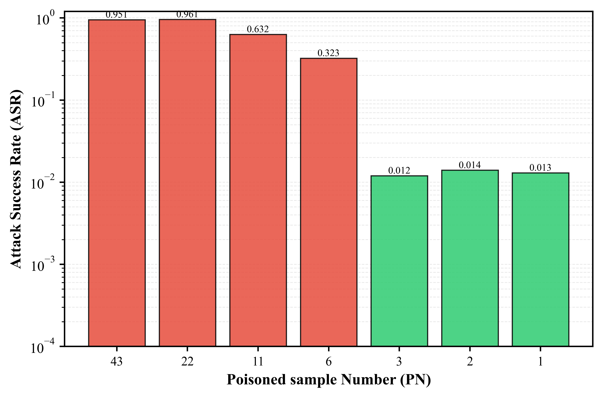
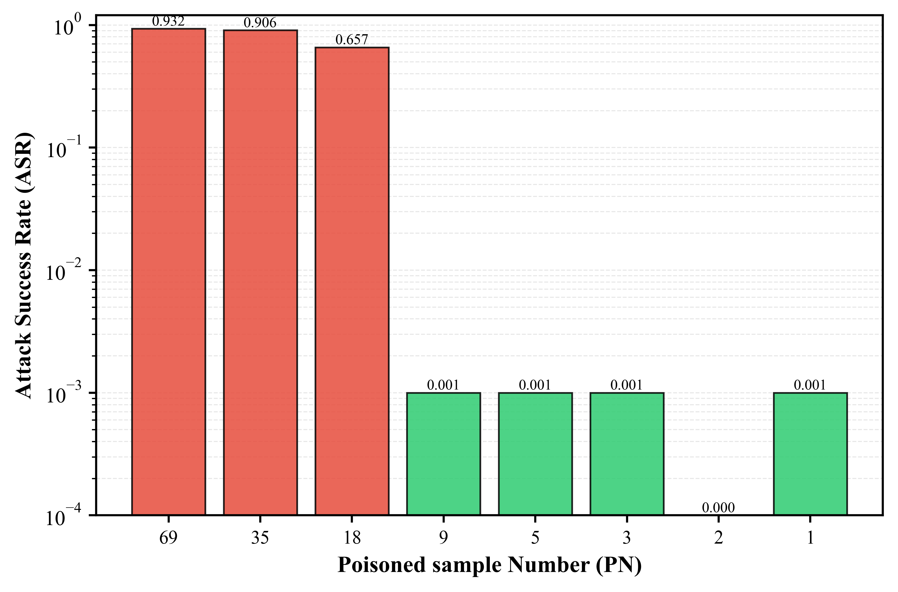

### Code Description:

**Backdoor model performance evaluation code (ASR, ACC):** backdoor_eval.py

**Mutation model generation:** defense/our/mutation/model_mutation.py

**Mutation model evaluation on the poisoned training set:** defense/our/mutation/mutation_eval.py

**Class rank based on evaluation results:** defense/our/class_rank/main.py

**Defense training for our work:** defense/our/defense_train.py

**ASD defense:** defense/asd/defense_train.py

## Supplementary discussion and verification of the inconsistency between STRIP's "sample selection performance" and "final defense effect".

We conducted a control experiment in a BadNets attack scenario to examine the relationship between the number of poisoned samples (PN) and the attack success rate (ASR). By gradually reducing the number of PNs in the STRIP selection subset (approximately halving it each time), we observed the trend of ASR changes.

The experiment shows that STRIP's ASR often **"drops sharply"** after PN falls below a certain threshold, but it may remain at a high level before then. For example, in GTSRB-ResNet18, the ASR remains high (~0.95) even when PN drops from 65 to 9, then suddenly drops to ~0.003 at PN=5. This "threshold effect" is consistently observed across different datasets and model architectures.

We believe the reason is that the primary goal of STRIP is to **detect suspicious samples/inputs**, not specifically designed for "backdoor elimination at the model level by filtering the training set." Therefore, the phenomenon of **"PN being low but ASR not decreasing synchronously"** may occur. This highlights an important distinction between sample-level detection performance and model-level defense effectiveness.

The figures below visualize this phenomenon using log-scale y-axis to clearly show both high and low ASR values. Red bars indicate scenarios where the backdoor attack remains effective, while green bars indicate successful defense.

| CIFAR10-ResNet18 | CIFAR10-VGG19 |
|:---:|:---:|
|  |  |

| CIFAR10-DenseNet | GTSRB-ResNet18 |
|:---:|:---:|
|  |  |

| GTSRB-VGG19 | GTSRB-DenseNet |
|:---:|:---:|
|  |  |

| ImageNet-ResNet18 | ImageNet-DenseNet |
|:---:|:---:|
|  |  |

