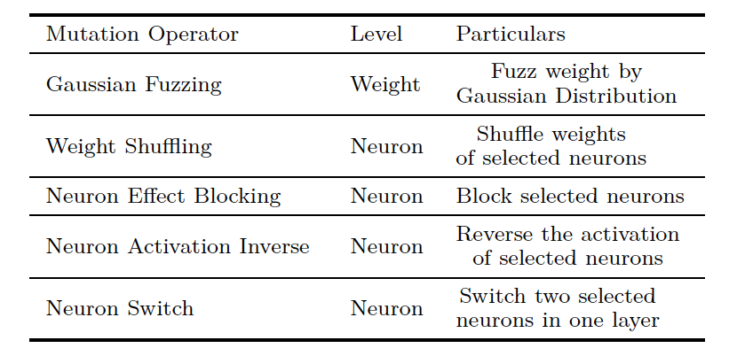
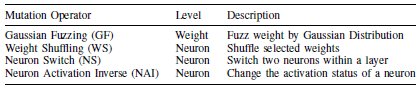

Paper:Shen未完成
Attacks:[
{
    name:BadNets
    code:https://github.com/Simba-brother/BackdoorBox
    paper: Badnets: Evaluating Backdooring Attacks on Deep Neural Networks. IEEE Access, 2019.
},
{
    name:TrojanNN
    code:https://github.com/PurduePAML/TrojanNN
    paper:Trojaning attack on neural networks. NDSS, 2018
},
{
    name:DFST
    code:https://github.com/Megum1/DFST
    paper:Deep feature space trojan attack of neural networks by controlled detoxification. AAAI, 2021
}
]
<!--backdoor detection-->
baseline:[
{
    name:LCR
    paper:Adversarial sample detection for deep neural network through model mutation testing. ICSE 2019
},
{
    name:STRIP
    paper:STRIP: a defence against trojan attacks on deep neural networks. ACSAC, 2019
    code:https://github.com/garrisongys/STRIP
},
{
    name:Simple Random
}
]

Paper:Backdoor Defense via Adaptively Splitting Poisoned Dataset. CVPR, 2023
Name:ASD
code:https://github.com/KuofengGao/ASD.
Attacks:[
{
    name:BadNets (OK)
    code:https://github.com/Simba-brother/BackdoorBox
    paper: Badnets: Evaluating Backdooring Attacks on Deep Neural Networks. IEEE Access, 2019.
},
{
    name:Blend
    code:https://github.com/Simba-brother/BackdoorBox
    paper:Targeted Backdoor Attacks on Deep Learning Systems Using Data Poisoning. arXiv, 2017.
},
{
    name:WaNet(OK)
    code:https://github.com/Simba-brother/BackdoorBox 
    paper:WaNet - Imperceptible Warping-based Backdoor Attack. ICLR, 2021.
},
{
    name:IAD
    code:https://github.com/Simba-brother/BackdoorBox
    paper:Input-Aware Dynamic Backdoor Attack. NeurIPS, 2020.
},
{
    name:Refool
    code:https://github.com/Simba-brother/BackdoorBox (OK)
    paper:Reflection Backdoor: A Natural Backdoor Attack on Deep Neural Networks. ECCV, 2020.
},
{
    name:CLB (稍等)
    code:none
    paper:Clean-label backdoor attacks. 2018
},
{
    name:LabelConsistent (OK)
    code:https://github.com/Simba-brother/BackdoorBox
    paper:Label-Consistent Backdoor Attacks. arXiv, 2019.
},
{
    name:SleeperAgent (OK)
    code:https://github.com/Simba-brother/BackdoorBox
    paper:Sleeper Agent: Scalable Hidden Trigger Backdoors for Neural Networks Trained from Scratch. NeurIPS, 2022.
},
]
baseline:[
{
    name:FineTuning
    code:https://github.com/Simba-brother/BackdoorBox
    paper:Fine-Pruning: Defending Against Backdooring Attacks on Deep Neural Networks. RAID, 2018.
},
{
    name:NAD
    code:https://github.com/Simba-brother/BackdoorBox
    paper:Neural Attention Distillation: Erasing Backdoor Triggers from Deep Neural Networks. ICLR, 2021.
},
{
    name:ABL
    code:https://github.com/Simba-brother/BackdoorBox
    paper:Anti-Backdoor Learning: Training Clean Models on Poisoned Data. NeurIPS, 2021.
},
{
    name:DBD
    code:https://github.com/SCLBD/DBD
    paper:Backdoor defense via decoupling the training process. ICLR, 2022.
}
]

变异方法
paper:Shen未完成

paper:Adversarial sample detection for deep neural network through model mutation testing. ICSE 2019

